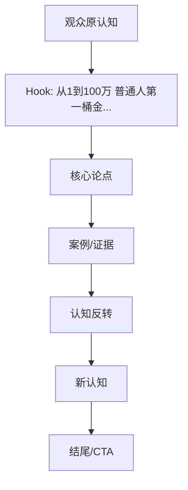
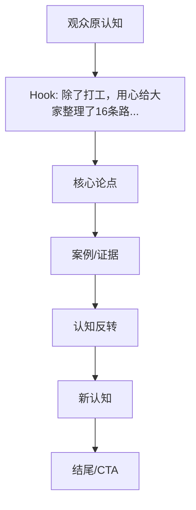

# Phase 3.1 LAN Review Bundle V3

**提交时间**: 2026-09-08 06:40 GMT+8
**状态**: READY_FOR_LAN_REVIEW
**Pipeline Version**: V2

---

## SAMPLE 1

### 基本信息
- **content_id**: 7302348364815928612
- **标题**: 从1到100万 普通人第一桶金
- **创作者**: 男***門
- **viral_type**: ABSOLUTE_VIRAL
- **时长**: 205.37秒
- **点赞**: 1,112,455
- **评论**: 61,476
- **收藏**: 279,069
- **分享**: 493,633

---

### Real Metrics V2

| 指标 | 值 |
|------|-----|
| 时长 | 205.37秒 |
| ASR Segments | 111 |
| Spoken Units | 111 |
| 平均意群长度 | 7.8字 |
| 中位意群长度 | 8字 |
| 短意群比例 | 88.3% |
| 长意群比例 | 0.0% |
| 总字符 | 863 |
| 字符/秒 | 4.2 |
| 问句数 | 0 |
| 问句率 | 0.0% |
| 第一人称 | 1 |
| 第二人称 | 25 |
| 转折词 | 3 |
| 对比词 | 8 |
| 案例标记 | 2 |
| 数字表达 | 0 |
| 填充词 | 5 |
| Transcript SHA256 | 63fdb916475cd05d |

---

### Complete Timeline

# Timeline Analysis

**Video Duration**: 205.4s
**Total Segments**: 111
**Generated**: 2026-09-08T06:40:20.389067

---

| Timeline ID | Time Range | Source Segments | Source Text | Function |
|-------------|------------|-----------------|-------------|----------|
| T001 | 0.00–5.32 | S0001,S0002 | 從一到一百萬普通人該怎麼賺到自己的第一桶... | HOOK |
| T002 | 5.32–7.28 | S0003 | 這個視頻你吸收的約多... | CLAIM |
| T003 | 7.28–37.24 | S0004,S0005,S0006,S0007,S0008,S0009,S0010,S0011,S0012,S0013,S0014,S0015,S0016,S0017 | 大概率在三十歲以內就能賺到一定要記得從零到一的考驗是你的個人能力從一到一百則考驗的是團隊能力總之能力所以從零到一你要不停的學習做跌帶打開自己的思想首先如果你不是... | EXPLANATION |
| T004 | 37.24–39.72 | S0018 | 比如你還是一個上班級... | EXAMPLE |
| T005 | 39.72–63.16 | S0019,S0020,S0021,S0022,S0023,S0024,S0025,S0026,S0027,S0028,S0029,S0030 | 就一定要學會客具自己的臺項把數字降下來你省出來的這一部分錢會積少省多千萬不要小開數字你的工資信用卡 花貝 戒備 儘量 謹慎一點因為沒有任何人會給你偽裝出來的大方... | EXPLANATION |
| T006 | 63.16–65.20 | S0031 | 比如說你身上有十萬... | EXAMPLE |
| T007 | 65.20–165.08 | S0032,S0033,S0034,S0035,S0036,S0037,S0038,S0039,S0040,S0041,S0042,S0043,S0044,S0045,S0046,S0047,S0048,S0049,S0050,S0051,S0052,S0053,S0054,S0055,S0056,S0057,S0058,S0059,S0060,S0061,S0062,S0063,S0064,S0065,S0066,S0067,S0068,S0069,S0070,S0071,S0072,S0073,S0074,S0075,S0076,S0077,S0078,S0079,S0080,S0081,S0082,S0083,S0084,S0085,S0086,S0087 | 三十萬 五十萬不要去買車買吧首先如果不是必要帶路這次錢根本不足以能讓你買量很好的車而買方在大城市有可能點一間廁所都買不到這個時候你就會去借錢家裡只挽廣袋各種路這... | EXPLANATION |
| T008 | 165.08–203.24 | S0088,S0089,S0090,S0091,S0092,S0093,S0094,S0095,S0096,S0097,S0098,S0099,S0100,S0101,S0102,S0103,S0104,S0105,S0106,S0107,S0108,S0109,S0110 | 電商百分之九十九個操作流程都有標準的案子會差了 會朝就是而自媒體不論尋找你的對標客戶還是你自己做的先訴不要想要準備得多完畢雖然現在已經進入到了一個存量的時代但優... | ENDING |
| T009 | 203.24–205.24 | S0111 | 都不是好事... | ENDING |

---

## Segment Detail

| Segment ID | Time | Text |
|------------|------|------|
| S0001 | 0.00–2.04 | 從一到一百萬... |
| S0002 | 2.04–5.32 | 普通人該怎麼賺到自己的第一桶... |
| S0003 | 5.32–7.28 | 這個視頻你吸收的約多... |
| S0004 | 7.28–10.52 | 大概率在三十歲以內就能賺到... |
| S0005 | 10.52–11.52 | 一定要記得... |
| S0006 | 11.52–14.92 | 從零到一的考驗是你的個人能力... |
| S0007 | 14.92–17.68 | 從一到一百則考驗的是團隊能力... |
| S0008 | 17.68–18.52 | 總之能力... |
| S0009 | 18.52–19.80 | 所以從零到一... |
| S0010 | 19.80–22.32 | 你要不停的學習做跌帶... |
| S0011 | 22.32–24.00 | 打開自己的思想... |
| S0012 | 24.00–26.28 | 首先如果你不是富二代... |
| S0013 | 26.28–29.20 | 你的第一筆錢只有三個來源的方向... |
| S0014 | 29.20–32.00 | 打工 借錢 帶塊... |
| S0015 | 32.00–33.68 | 如果你不靠後兩者... |
| S0016 | 33.68–35.48 | 那你第一筆錢一定是靠... |
| S0017 | 35.48–37.24 | 積累擋下來的... |
| S0018 | 37.24–39.72 | 比如你還是一個上班級... |
| S0019 | 39.72–42.92 | 就一定要學會客具自己的臺項... |
| S0020 | 42.92–44.36 | 把數字降下來... |
| S0021 | 44.36–46.12 | 你省出來的這一部分錢... |
| S0022 | 46.12–47.72 | 會積少省多... |
| S0023 | 47.72–49.56 | 千萬不要小開數字... |
| S0024 | 49.56–50.56 | 你的工資... |
| S0025 | 50.56–54.16 | 信用卡 花貝 戒備 儘量 謹慎一點... |
| S0026 | 54.16–56.04 | 因為沒有任何人會給你... |
| S0027 | 56.24–59.20 | 偽裝出來的大方而買的... |
| S0028 | 59.20–59.88 | 第二... |
| S0029 | 59.88–61.44 | 當你手裡說錢... |
| S0030 | 61.44–63.16 | 積累到一定的額路口子... |
| S0031 | 63.16–65.20 | 比如說你身上有十萬... |
| S0032 | 65.20–66.96 | 三十萬 五十萬... |
| S0033 | 66.96–68.48 | 不要去買車買吧... |
| S0034 | 68.48–69.80 | 首先... |
| S0035 | 69.80–71.60 | 如果不是必要帶路... |
| S0036 | 71.60–73.28 | 這次錢根本不足以... |
| S0037 | 73.28–75.84 | 能讓你買量很好的車... |
| S0038 | 75.84–78.20 | 而買方在大城市有可能... |
| S0039 | 78.20–80.64 | 點一間廁所都買不到... |
| S0040 | 80.64–82.84 | 這個時候你就會去借錢... |
| S0041 | 82.84–85.60 | 家裡只挽廣袋各種路... |
| S0042 | 85.60–87.16 | 這些對你這個階段來說... |
| S0043 | 87.16–89.40 | 就是負債和家屬... |
| S0044 | 89.40–90.24 | 說白了... |
| S0045 | 90.24–92.24 | 你不一定能把握著我的住宅... |
| S0046 | 92.24–94.00 | 而這個錢最好的用途... |
| S0047 | 94.00–95.44 | 就是繼續勻掌... |
| S0048 | 95.44–97.28 | 勻掌學習的機會... |
| S0049 | 97.28–98.44 | 勻掌清資產... |
| S0050 | 98.44–99.84 | 還有些小成本... |
| S0051 | 99.84–101.84 | 賺錢的項目去貼繫... |
| S0052 | 101.84–103.92 | 如果不前進你不成長... |
| S0053 | 103.92–105.64 | 你二十歲的時候... |
| S0054 | 105.64–107.48 | 一天只一千塊... |
| S0055 | 107.48–108.64 | 能到了三十五歲... |
| S0056 | 108.64–111.20 | 一天只值一半一半... |
| S0057 | 111.20–113.12 | 這就是最簡單的道理... |
| S0058 | 113.12–115.72 | 如果最後你想拿著積累的這個... |
| S0059 | 115.72–117.08 | 錢來創意... |
| S0060 | 117.08–119.40 | 你一定不要想得過一晚可放... |
| S0061 | 119.40–120.96 | 一定要選擇低成本... |
| S0062 | 120.96–122.60 | 可負債的項目... |
| S0063 | 122.60–125.20 | 很多人創業喜歡搞店面... |
| S0064 | 125.20–126.28 | 搞個小超市... |
| S0065 | 126.28–127.20 | 小優官... |
| S0066 | 127.20–128.72 | 或者那麼服裝店... |
| S0067 | 128.72–130.40 | 就是抱著每天開門... |
| S0068 | 130.40–132.60 | 等客與官們分享... |
| S0069 | 132.60–133.48 | 有可能來了... |
| S0070 | 133.48–134.48 | 直接來客人... |
| S0071 | 134.48–136.00 | 沒有就玩手機... |
| S0072 | 136.00–137.72 | 這種屬於偽創業... |
| S0073 | 137.72–139.92 | 這根本不能算創業... |
| S0074 | 139.92–141.92 | 衝擊量算個有點活幹... |
| S0075 | 141.92–143.28 | 算給年生... |
| S0076 | 143.28–144.76 | 比打工算得多一點... |
| S0077 | 144.76–147.52 | 辛苦的也是服務自己... |
| S0078 | 147.52–148.76 | 真正的創業... |
| S0079 | 148.76–150.60 | 放的是一份事業... |
| S0080 | 150.60–152.88 | 這份事業是可以讓你終身追求... |
| S0081 | 152.88–154.60 | 它不是人來愛為自己... |
| S0082 | 154.60–155.64 | 欺騙自己... |
| S0083 | 155.64–157.84 | 讓自己覺得再做事情... |
| S0084 | 157.84–160.00 | 愛定是可以持續的進步... |
| S0085 | 160.00–161.08 | 不停裂變... |
| S0086 | 161.08–162.80 | 持續做大的事情... |
| S0087 | 162.80–165.08 | 由電商或者自媒體... |
| S0088 | 165.08–167.08 | 電商百分之九十九個操作... |
| S0089 | 167.08–169.40 | 流程都有標準的案子... |
| S0090 | 169.40–171.32 | 會差了 會朝就是... |
| S0091 | 171.32–172.28 | 而自媒體... |
| S0092 | 172.28–174.00 | 不論尋找你的對標客戶... |
| S0093 | 174.00–175.28 | 還是你自己做的... |
| S0094 | 175.28–176.48 | 先訴... |
| S0095 | 176.48–178.48 | 不要想要準備得多完畢... |
| S0096 | 178.48–180.72 | 雖然現在已經進入到了一個... |
| S0097 | 180.72–182.00 | 存量的時代... |
| S0098 | 182.00–183.68 | 但優勝被探... |
| S0099 | 183.68–185.28 | 不充新鮮血液的規則... |
| S0100 | 185.28–187.28 | 永遠不可能變... |
| S0101 | 187.28–188.28 | 這種低成本... |
| S0102 | 188.28–189.60 | 可負這個項目... |
| S0103 | 189.60–190.52 | 你不錯... |
| S0104 | 190.52–191.84 | 非要投資大把... |
| S0105 | 191.84–194.36 | 選擇一些西洋的產業... |
| S0106 | 194.36–196.92 | 大老進去都能把從事... |
| S0107 | 196.92–197.96 | 一個小白... |
| S0108 | 197.96–199.36 | 能扛多久嗎... |
| S0109 | 199.36–200.56 | 一定要進去... |
| S0110 | 200.60–203.24 | 所有不可以負責的生意... |
| S0111 | 203.24–205.24 | 都不是好事... |

---

### Complete Transcript (first 50 segments)

[S0001] [00:00.00 - 00:02.04] 從一到一百萬
[S0002] [00:02.04 - 00:05.32] 普通人該怎麼賺到自己的第一桶
[S0003] [00:05.32 - 00:07.28] 這個視頻你吸收的約多
[S0004] [00:07.28 - 00:10.52] 大概率在三十歲以內就能賺到
[S0005] [00:10.52 - 00:11.52] 一定要記得
[S0006] [00:11.52 - 00:14.92] 從零到一的考驗是你的個人能力
[S0007] [00:14.92 - 00:17.68] 從一到一百則考驗的是團隊能力
[S0008] [00:17.68 - 00:18.52] 總之能力
[S0009] [00:18.52 - 00:19.80] 所以從零到一
[S0010] [00:19.80 - 00:22.32] 你要不停的學習做跌帶
[S0011] [00:22.32 - 00:24.00] 打開自己的思想
[S0012] [00:24.00 - 00:26.28] 首先如果你不是富二代
[S0013] [00:26.28 - 00:29.20] 你的第一筆錢只有三個來源的方向
[S0014] [00:29.20 - 00:32.00] 打工 借錢 帶塊
[S0015] [00:32.00 - 00:33.68] 如果你不靠後兩者
[S0016] [00:33.68 - 00:35.48] 那你第一筆錢一定是靠
[S0017] [00:35.48 - 00:37.24] 積累擋下來的
[S0018] [00:37.24 - 00:39.72] 比如你還是一個上班級
[S0019] [00:39.72 - 00:42.92] 就一定要學會客具自己的臺項
[S0020] [00:42.92 - 00:44.36] 把數字降下來
[S0021] [00:44.36 - 00:46.12] 你省出來的這一部分錢
[S0022] [00:46.12 - 00:47.72] 會積少省多
[S0023] [00:47.72 - 00:49.56] 千萬不要小開數字
[S0024] [00:49.56 - 00:50.56] 你的工資
[S0025] [00:50.56 - 00:54.16] 信用卡 花貝 戒備 儘量 謹慎一點
[S0026] [00:54.16 - 00:56.04] 因為沒有任何人會給你
[S0027] [00:56.24 - 00:59.20] 偽裝出來的大方而買的
[S0028] [00:59.20 - 00:59.88] 第二
[S0029] [00:59.88 - 01:01.44] 當你手裡說錢
[S0030] [01:01.44 - 01:03.16] 積累到一定的額路口子
[S0031] [01:03.16 - 01:05.20] 比如說你身上有十萬
[S0032] [01:05.20 - 01:06.96] 三十萬 五十萬
[S0033] [01:06.96 - 01:08.48] 不要去買車買吧
[S0034] [01:08.48 - 01:09.80] 首先
[S0035] [01:09.80 - 01:11.60] 如果不是必要帶路
[S0036] [01:11.60 - 01:13.28] 這次錢根本不足以
[S0037] [01:13.28 - 01:15.84] 能讓你買量很好的車
[S0038] [01:15.84 - 01:18.20] 而買方在大城市有可能
[S0039] [01:18.20 - 01:20.64] 點一間廁所都買不到
[S0040] [01:20.64 - 01:22.84] 這個時候你就會去借錢
[S0041] [01:22.84 - 01:25.60] 家裡只挽廣袋各種路
[S0042] [01:25.60 - 01:27.16] 這些對你這個階段來說
[S0043] [01:27.16 - 01:29.40] 就是負債和家屬
[S0044] [01:29.40 - 01:30.24] 說白了
[S0045] [01:30.24 - 01:32.24] 你不一定能把握著我的住宅
[S0046] [01:32.24 - 01:34.00] 而這個錢最好的用途
[S0047] [01:34.00 - 01:35.44] 就是繼續勻掌
[S0048] [01:35.44 - 01:37.28] 勻掌學習的機會
[S0049] [01:37.28 - 01:38.44] 勻掌清資產
[S0050] [01:38.44 - 01:39.84] 還有些小成本
[S0051] [01:39.84 - 01:41.84] 賺錢的項目去貼繫
[S0052] [01:41.84 - 01:43.92] 如果不前進你不成長
[S0053] [01:43.92 - 01:45.64] 你二十歲的時候
[S0054] [01:45.64 - 01:47.48] 一天只一千塊
[S0055] [01:47.48 - 01:48.64] 能到了三十五歲
... (112 total segments)

---

### Logic Map (To be filled during Deep Analysis)

*Logic Map待基于真实Segment绑定后填充*

---

## SAMPLE 2

### 基本信息
- **content_id**: 7647797848847439706
- **标题**: 普通人如何靠卖货翻身
- **创作者**: 辉***累
- **viral_type**: RELATIVE_BREAKOUT
- **时长**: 170.2秒
- **点赞**: 144,012
- **评论**: 16,989
- **收藏**: 56,538
- **分享**: 26,515

---

### Real Metrics V2

| 指标 | 值 |
|------|-----|
| 时长 | 170.2秒 |
| ASR Segments | 99 |
| Spoken Units | 99 |
| 平均意群长度 | 8.7字 |
| 中位意群长度 | 9字 |
| 短意群比例 | 71.7% |
| 长意群比例 | 0.0% |
| 总字符 | 864 |
| 字符/秒 | 5.08 |
| 问句数 | 5 |
| 问句率 | 5.1% |
| 第一人称 | 7 |
| 第二人称 | 31 |
| 转折词 | 5 |
| 对比词 | 0 |
| 案例标记 | 0 |
| 数字表达 | 4 |
| 填充词 | 21 |
| Transcript SHA256 | 6c0e2d097d5e26d4 |

---

### Complete Timeline

# Timeline Analysis

**Video Duration**: 170.2s
**Total Segments**: 99
**Generated**: 2026-09-08T06:40:20.561777

---

| Timeline ID | Time Range | Source Segments | Source Text | Function |
|-------------|------------|-----------------|-------------|----------|
| T001 | 0.00–5.72 | S0001,S0002,S0003,S0004 | 尽量不要去打工实在不行你就一边打工一边找一个靠谱的产品去卖... | HOOK |
| T002 | 5.72–74.20 | S0005,S0006,S0007,S0008,S0009,S0010,S0011,S0012,S0013,S0014,S0015,S0016,S0017,S0018,S0019,S0020,S0021,S0022,S0023,S0024,S0025,S0026,S0027,S0028,S0029,S0030,S0031,S0032,S0033,S0034,S0035,S0036,S0037,S0038,S0039,S0040,S0041,S0042,S0043,S0044 | 只要是开始卖东西你就会快速的进入到真实的社会的模式这句话是我花了十年的时间赚了无数次的南墙才误出来的那为什么不建议打工呢打工的本质就是你把你的时间体力情绪打包卖... | EXPLANATION |
| T003 | 74.20–77.16 | S0045 | 但是你把下班刷短视频的时间... | REVERSAL |
| T004 | 77.16–114.60 | S0046,S0047,S0048,S0049,S0050,S0051,S0052,S0053,S0054,S0055,S0056,S0057,S0058,S0059,S0060,S0061,S0062,S0063,S0064,S0065 | 拿出来去给我卖东西那卖什么找你自己觉得不错的敢推荐给你身边朋友的东西就可以了咱们社群里边有一个就是从事工厂至今远的他每天内的都要死了他发现场边有大量的优质委惑通... | EXPLANATION |
| T005 | 114.60–116.36 | S0066 | 不但是一没小小的罗斯丁了... | REVERSAL |
| T006 | 116.36–136.80 | S0067,S0068,S0069,S0070,S0071,S0072,S0073,S0074,S0075,S0076,S0077,S0078 | 他是一个董选品董流量董成交的生意人理解吧那为什么卖东西会是成长最快的因为你要去指面忍性被熟人炒粉哎呦你怎么变得这么同仇人了被那个默熟人直接转账你难递指的不合对被... | EXPLANATION |
| T007 | 136.80–169.68 | S0079,S0080,S0081,S0082,S0083,S0084,S0085,S0086,S0087,S0088,S0089,S0090,S0091,S0092,S0093,S0094,S0095,S0096,S0097,S0098 | 被拒绝1000次理解这个意思吗当你的这个玻璃心碎了一地然后又重新沾起来的时候他就变成了防弹玻璃了这种锻炼你坐在办公室里面三年连练不出来所以说别再把这个希望继托在... | ENDING |
| T008 | 169.68–170.20 | S0099 | RISPER... | ENDING |

---

## Segment Detail

| Segment ID | Time | Text |
|------------|------|------|
| S0001 | 0.00–1.20 | 尽量不要去打工... |
| S0002 | 1.20–1.92 | 实在不行... |
| S0003 | 1.92–2.92 | 你就一边打工... |
| S0004 | 2.92–5.72 | 一边找一个靠谱的产品去卖... |
| S0005 | 5.72–7.32 | 只要是开始卖东西... |
| S0006 | 7.32–10.36 | 你就会快速的进入到真实的社会的模式... |
| S0007 | 10.36–12.44 | 这句话是我花了十年的时间... |
| S0008 | 12.44–14.40 | 赚了无数次的南墙才误出来的... |
| S0009 | 14.40–16.20 | 那为什么不建议打工呢... |
| S0010 | 16.20–18.44 | 打工的本质就是你把你的时间体力... |
| S0011 | 18.44–20.64 | 情绪打包卖给了老板... |
| S0012 | 20.64–21.76 | 那么在这套体系里面... |
| S0013 | 21.76–24.20 | 你就是那个被保护起来的罗斯丁... |
| S0014 | 24.20–25.88 | 不用知道产品怎么卖... |
| S0015 | 25.88–26.68 | 不用懂客户... |
| S0016 | 26.68–27.88 | 为什么会离去... |
| S0017 | 27.88–30.16 | 你只要PPT写得好就可以了... |
| S0018 | 30.16–31.92 | 打工给你最大的毒药... |
| S0019 | 31.92–33.64 | 它就掉到确定性... |
| S0020 | 33.64–35.12 | 每个月到了日子... |
| S0021 | 35.12–37.08 | 那个工资雷打不动道仗... |
| S0022 | 37.08–38.68 | 这种虚假的安全感... |
| S0023 | 38.68–39.92 | 会一点点废掉... |
| S0024 | 39.92–42.48 | 你这个感知真实时间的能力... |
| S0025 | 42.48–44.04 | 等到了35岁... |
| S0026 | 44.04–44.84 | 你被优化... |
| S0027 | 44.84–46.12 | 被扔回了社会... |
| S0028 | 46.12–47.60 | 你才发现除了内号... |
| S0029 | 47.60–49.36 | 会写这个周报... |
| S0030 | 49.36–52.40 | 你根本就看不懂这个社会是怎么运转的... |
| S0031 | 52.40–54.60 | 那么什么才是真实的社会模式呢... |
| S0032 | 54.60–56.56 | 就是交易... |
| S0033 | 56.56–58.32 | 市场不认你的头显... |
| S0034 | 58.32–61.08 | 只认你能不能够把产品卖出去... |
| S0035 | 61.08–61.80 | 很多人跟我说... |
| S0036 | 61.80–62.80 | 我不敢辞职... |
| S0037 | 62.80–65.00 | 让我没有本金用怕失败... |
| S0038 | 65.00–66.52 | 所以我才跟你们讲嘛... |
| S0039 | 66.52–67.32 | 实在不行... |
| S0040 | 67.32–69.96 | 你就边打工边卖东西... |
| S0041 | 69.96–71.04 | 保留你的工资... |
| S0042 | 71.04–72.12 | 那个是你的底线... |
| S0043 | 72.12–73.36 | 让你没有业绩的时候... |
| S0044 | 73.36–74.20 | 也不用慌... |
| S0045 | 74.20–77.16 | 但是你把下班刷短视频的时间... |
| S0046 | 77.16–78.76 | 拿出来去给我卖东西... |
| S0047 | 78.76–79.88 | 那卖什么... |
| S0048 | 79.88–82.52 | 找你自己觉得不错的... |
| S0049 | 82.52–85.00 | 敢推荐给你身边朋友的东西... |
| S0050 | 85.00–86.28 | 就可以了... |
| S0051 | 86.28–87.48 | 咱们社群里边有一个... |
| S0052 | 87.48–89.92 | 就是从事工厂至今远的... |
| S0053 | 89.92–91.68 | 他每天内的都要死了... |
| S0054 | 91.68–95.24 | 他发现场边有大量的优质委惑通庄... |
| S0055 | 95.24–97.76 | 他下来班就拍照片发到网上... |
| S0056 | 97.76–98.96 | 就不断地去卖... |
| S0057 | 98.96–99.92 | 就展示这个衣服... |
| S0058 | 99.92–101.20 | 怎么系列不变形... |
| S0059 | 101.20–103.12 | 或者是各种其他的优势... |
| S0060 | 103.12–105.24 | 一开始一个月只能赚几百块钱... |
| S0061 | 105.24–107.96 | 后来他就摸透了这个流量的规则... |
| S0062 | 107.96–108.88 | 副业的收入... |
| S0063 | 108.88–110.64 | 直接超过了他主业的三倍... |
| S0064 | 110.64–113.52 | 他这个时候他才敢去离职... |
| S0065 | 113.52–114.60 | 因为那个时候他已经... |
| S0066 | 114.60–116.36 | 不但是一没小小的罗斯丁了... |
| S0067 | 116.36–117.56 | 他是一个董选品... |
| S0068 | 117.56–119.88 | 董流量董成交的生意人... |
| S0069 | 119.88–120.80 | 理解吧... |
| S0070 | 120.80–123.68 | 那为什么卖东西会是成长最快的... |
| S0071 | 123.68–125.76 | 因为你要去指面忍性... |
| S0072 | 125.76–127.56 | 被熟人炒粉... |
| S0073 | 127.56–127.80 | 哎呦... |
| S0074 | 127.80–130.60 | 你怎么变得这么同仇人了... |
| S0075 | 130.60–132.68 | 被那个默熟人直接转账... |
| S0076 | 132.68–134.32 | 你难递指的不合对... |
| S0077 | 134.32–135.36 | 被放隔子... |
| S0078 | 135.36–136.80 | 被比价格... |
| S0079 | 136.80–138.64 | 被拒绝1000次... |
| S0080 | 138.64–139.44 | 理解这个意思吗... |
| S0081 | 139.44–140.96 | 当你的这个玻璃心碎了一地... |
| S0082 | 140.96–142.88 | 然后又重新沾起来的时候... |
| S0083 | 142.88–145.36 | 他就变成了防弹玻璃了... |
| S0084 | 145.36–146.24 | 这种锻炼... |
| S0085 | 146.24–148.72 | 你坐在办公室里面三年连练不出来... |
| S0086 | 148.72–150.60 | 所以说别再把这个希望... |
| S0087 | 150.60–152.12 | 继托在长心姿... |
| S0088 | 152.12–154.04 | 什么500块1000块钱上了... |
| S0089 | 154.04–154.80 | 今天开始... |
| S0090 | 154.80–156.32 | 你就开始发一套碰圈... |
| S0091 | 156.32–157.52 | 告诉所有人... |
| S0092 | 157.52–160.24 | 你在卖一个真的不错的东西... |
| S0093 | 160.24–161.12 | 哪怕你第一个月... |
| S0094 | 161.12–161.96 | 一分钱没有赚... |
| S0095 | 161.96–164.52 | 只要你开始站在这个卖家的视角... |
| S0096 | 164.52–166.08 | 去看待这个社会... |
| S0097 | 166.08–167.64 | 那么你的思维方式... |
| S0098 | 167.64–169.68 | 就已经开始列表了... |
| S0099 | 169.68–170.20 | RISPER... |

---

### Complete Transcript (first 50 segments)

[S0001] [00:00.00 - 00:01.20] 尽量不要去打工
[S0002] [00:01.20 - 00:01.92] 实在不行
[S0003] [00:01.92 - 00:02.92] 你就一边打工
[S0004] [00:02.92 - 00:05.72] 一边找一个靠谱的产品去卖
[S0005] [00:05.72 - 00:07.32] 只要是开始卖东西
[S0006] [00:07.32 - 00:10.36] 你就会快速的进入到真实的社会的模式
[S0007] [00:10.36 - 00:12.44] 这句话是我花了十年的时间
[S0008] [00:12.44 - 00:14.40] 赚了无数次的南墙才误出来的
[S0009] [00:14.40 - 00:16.20] 那为什么不建议打工呢
[S0010] [00:16.20 - 00:18.44] 打工的本质就是你把你的时间体力
[S0011] [00:18.44 - 00:20.64] 情绪打包卖给了老板
[S0012] [00:20.64 - 00:21.76] 那么在这套体系里面
[S0013] [00:21.76 - 00:24.20] 你就是那个被保护起来的罗斯丁
[S0014] [00:24.20 - 00:25.88] 不用知道产品怎么卖
[S0015] [00:25.88 - 00:26.68] 不用懂客户
[S0016] [00:26.68 - 00:27.88] 为什么会离去
[S0017] [00:27.88 - 00:30.16] 你只要PPT写得好就可以了
[S0018] [00:30.16 - 00:31.92] 打工给你最大的毒药
[S0019] [00:31.92 - 00:33.64] 它就掉到确定性
[S0020] [00:33.64 - 00:35.12] 每个月到了日子
[S0021] [00:35.12 - 00:37.08] 那个工资雷打不动道仗
[S0022] [00:37.08 - 00:38.68] 这种虚假的安全感
[S0023] [00:38.68 - 00:39.92] 会一点点废掉
[S0024] [00:39.92 - 00:42.48] 你这个感知真实时间的能力
[S0025] [00:42.48 - 00:44.04] 等到了35岁
[S0026] [00:44.04 - 00:44.84] 你被优化
[S0027] [00:44.84 - 00:46.12] 被扔回了社会
[S0028] [00:46.12 - 00:47.60] 你才发现除了内号
[S0029] [00:47.60 - 00:49.36] 会写这个周报
[S0030] [00:49.36 - 00:52.40] 你根本就看不懂这个社会是怎么运转的
[S0031] [00:52.40 - 00:54.60] 那么什么才是真实的社会模式呢
[S0032] [00:54.60 - 00:56.56] 就是交易
[S0033] [00:56.56 - 00:58.32] 市场不认你的头显
[S0034] [00:58.32 - 01:01.08] 只认你能不能够把产品卖出去
[S0035] [01:01.08 - 01:01.80] 很多人跟我说
[S0036] [01:01.80 - 01:02.80] 我不敢辞职
[S0037] [01:02.80 - 01:05.00] 让我没有本金用怕失败
[S0038] [01:05.00 - 01:06.52] 所以我才跟你们讲嘛
[S0039] [01:06.52 - 01:07.32] 实在不行
[S0040] [01:07.32 - 01:09.96] 你就边打工边卖东西
[S0041] [01:09.96 - 01:11.04] 保留你的工资
[S0042] [01:11.04 - 01:12.12] 那个是你的底线
[S0043] [01:12.12 - 01:13.36] 让你没有业绩的时候
[S0044] [01:13.36 - 01:14.20] 也不用慌
[S0045] [01:14.20 - 01:17.16] 但是你把下班刷短视频的时间
[S0046] [01:17.16 - 01:18.76] 拿出来去给我卖东西
[S0047] [01:18.76 - 01:19.88] 那卖什么
[S0048] [01:19.88 - 01:22.52] 找你自己觉得不错的
[S0049] [01:22.52 - 01:25.00] 敢推荐给你身边朋友的东西
[S0050] [01:25.00 - 01:26.28] 就可以了
[S0051] [01:26.28 - 01:27.48] 咱们社群里边有一个
[S0052] [01:27.48 - 01:29.92] 就是从事工厂至今远的
[S0053] [01:29.92 - 01:31.68] 他每天内的都要死了
[S0054] [01:31.68 - 01:35.24] 他发现场边有大量的优质委惑通庄
[S0055] [01:35.24 - 01:37.76] 他下来班就拍照片发到网上
... (100 total segments)

---

### Logic Map (To be filled during Deep Analysis)

*Logic Map待基于真实Segment绑定后填充*

---

## SAMPLE 3

### 基本信息
- **content_id**: 7546212425998454074
- **标题**: 除了打工，用心给大家整理了16条路
- **创作者**: 小***究
- **viral_type**: NORMAL_REFERENCE
- **时长**: 245.83秒
- **点赞**: 410,006
- **评论**: 106,874
- **收藏**: 263,470
- **分享**: 83,064

---

### Real Metrics V2

| 指标 | 值 |
|------|-----|
| 时长 | 245.83秒 |
| ASR Segments | 102 |
| Spoken Units | 102 |
| 平均意群长度 | 15.9字 |
| 中位意群长度 | 15字 |
| 短意群比例 | 16.7% |
| 长意群比例 | 0.0% |
| 总字符 | 1622 |
| 字符/秒 | 6.6 |
| 问句数 | 1 |
| 问句率 | 1.0% |
| 第一人称 | 19 |
| 第二人称 | 18 |
| 转折词 | 6 |
| 对比词 | 3 |
| 案例标记 | 7 |
| 数字表达 | 2 |
| 填充词 | 8 |
| Transcript SHA256 | 5cd8c03bd03ee125 |

---

### Complete Timeline

# Timeline Analysis

**Video Duration**: 245.8s
**Total Segments**: 102
**Generated**: 2026-09-08T06:40:20.679101

---

| Timeline ID | Time Range | Source Segments | Source Text | Function |
|-------------|------------|-----------------|-------------|----------|
| T001 | 0.00–5.30 | S0001,S0002 | 除了打工 至少還有16種賺錢的方法今天我給大家整理了16個全廣所有的搞錢思路... | HOOK |
| T002 | 5.30–9.30 | S0003 | 一次性開隔局 大家可以對照適合自己路線提高個人生產力... | CLAIM |
| T003 | 9.30–39.80 | S0004,S0005,S0006,S0007,S0008,S0009,S0010,S0011,S0012 | 第一種 轉擦架的錢 說白了 就是當中間商什麼東西 這一邊便宜那邊會 就把他從甜蜜的地方 賣到貴的地方別覺得這件事情老土 這個是最古早 也最有效的專程邏輯第二種是... | EXPLANATION |
| T004 | 39.80–42.40 | S0013 | 但是別人沒有的東西 可能是一種獨特的技術... | REVERSAL |
| T005 | 42.40–75.40 | S0014,S0015,S0016,S0017,S0018,S0019,S0020,S0021,S0022,S0023,S0024 | 也有可能是一種別人接觸不到的人賣資源或者是一個別人買到的渠道 人物我有就是王牌一旦掌握了稀缺資源 並價權就在我們的手裡面第四種是賺出城的錢 一個人可能幹到類似 ... | EXPLANATION |
| T006 | 75.40–77.80 | S0025 | 是中間的利潤 是超貨我們的想像的... | EXAMPLE |
| T007 | 77.80–84.50 | S0026,S0027 | 第六種 賺任之差的錢 記住有一句話是叫內行 賺外行的錢大家在自己的行業裡面擔酒了 會麻木... | EXPLANATION |
| T008 | 84.50–87.00 | S0028 | 但是你總規是比圈外人懂得多吧... | REVERSAL |
| T009 | 87.00–112.40 | S0029,S0030,S0031,S0032,S0033,S0034,S0035,S0036,S0037 | 這個就是咱們的資本 你可以做培訓 做諮詢 做付費社群把你的專業支持變成錢 第七種是賺品牌的錢為什麼同樣已經衣服貼一個品牌的標 它的價格就可以發好幾倍這個就是屬於... | EXPLANATION |
| T010 | 112.40–115.10 | S0038 | 就算擔見的利潤不像指體一樣 就像那間工廠一樣... | EXAMPLE |
| T011 | 115.10–117.00 | S0039 | 但是因為它的數量過於巨大... | REVERSAL |
| T012 | 117.00–154.90 | S0040,S0041,S0042,S0043,S0044,S0045,S0046,S0047,S0048,S0049,S0050,S0051,S0052,S0053,S0054,S0055,S0056,S0057 | 最後算下來也是一筆巨款因為量大 我們就有底氣去跟更上流的供應商去加價第九種是賺十間差的錢純純幫一個班運工可以把國外已經火爆的項目搬到國內來做也可以把一線城市的已... | EXPLANATION |
| T013 | 154.90–158.70 | S0058,S0059 | 但是這一步是很難的 到處都是坑但是一旦我們頭對了... | REVERSAL |
| T014 | 158.70–181.00 | S0060,S0061,S0062,S0063,S0064,S0065,S0066,S0067,S0068,S0069,S0070 | 也不是新京苦苦的賺給小錢了那是資產的被增第十二是賺廣告的錢有的時候最簡單粗暴的方法最有效找到目標客戶聚集的渠道用廣告進行無差別高頻的轟炸當我們的廣告鋪天在地的時... | EXPLANATION |
| T015 | 181.00–183.80 | S0071 | 特別是離品 比如說月餅 茶葉 高端酒... | EXAMPLE |
| T016 | 183.80–186.00 | S0072 | 可能幾有的成本才到十塊錢... | EXPLANATION |
| T017 | 186.00–187.70 | S0073 | 但是盒子花三十塊錢... | REVERSAL |
| T018 | 187.70–198.20 | S0074,S0075,S0076,S0077,S0078 | 在這些領域裡面 賣包裝可能是比賣產品本身更有賺投第十四是賺西分領域的錢不要總想做所有人的生意我們可以把我們的客戶群體縮小再縮小... | EXPLANATION |
| T019 | 198.20–219.20 | S0079,S0080,S0081,S0082,S0083,S0084,S0085,S0086,S0087,S0088 | 因為中國的人口技術過大哪怕我們只服務一個極其微小的群體這個市場也足夠可以養過我們找到這群人 然後把我們的產品精準地賣給他們第十五是賺人設的錢在這個時代 自己就是... | ENDING |
| T020 | 219.20–221.30 | S0089 | 賺錢對於他們而言 真的像呼吸一樣簡單... | EXAMPLE |
| T021 | 221.30–230.90 | S0090,S0091,S0092,S0093,S0094 | 第十六 賺電接的錢這個是真正的控制套白狼如果你有一個朋友有資源你另外一個朋友他有需求你可以把他們兩個一戳合在中間去賺取擁金... | ENDING |
| T022 | 230.90–232.80 | S0095 | 比如說房地產中介 婚介所... | EXAMPLE |
| T023 | 232.80–243.70 | S0096,S0097,S0098,S0099,S0100,S0101 | 其實他們都是這個模式可以去翻翻你的模型好有看你看自己能不能成為那個千線大橋的人好了 我希望今天的分享可以給大家打開新的門選擇一個對方向去挖掘 去行動... | ENDING |
| T024 | 243.70–245.80 | S0102 | 只有最終行動了才可以改變現狀... | ENDING |

---

## Segment Detail

| Segment ID | Time | Text |
|------------|------|------|
| S0001 | 0.00–2.30 | 除了打工 至少還有16種賺錢的方法... |
| S0002 | 2.30–5.30 | 今天我給大家整理了16個全廣所有的搞錢思路... |
| S0003 | 5.30–9.30 | 一次性開隔局 大家可以對照適合自己路線提高個人生產力... |
| S0004 | 9.30–12.30 | 第一種 轉擦架的錢 說白了 就是當中間商... |
| S0005 | 12.30–15.90 | 什麼東西 這一邊便宜那邊會 就把他從甜蜜的地方 賣到貴的地方... |
| S0006 | 15.90–19.50 | 別覺得這件事情老土 這個是最古早 也最有效的專程邏輯... |
| S0007 | 19.50–23.70 | 第二種是賺流量的錢 現在誰都不快手機 這個就是我們的機會... |
| S0008 | 23.70–27.00 | 不論是哪個平台 你可以去發文章 發視頻做直播... |
| S0009 | 27.00–30.60 | 只要有人看的地方你就有了流量 有的流量 你就可以買自己的產品... |
| S0010 | 30.60–32.60 | 沒有貨員 就可以買別人的拿分成... |
| S0011 | 32.60–36.40 | 甚至你還可以接廣告 幫商家戴貨 流量 本質上就是錢... |
| S0012 | 36.40–39.80 | 第三種 賺稀缺的錢 把它盤點一下手裡面有沒有 你有... |
| S0013 | 39.80–42.40 | 但是別人沒有的東西 可能是一種獨特的技術... |
| S0014 | 42.40–44.60 | 也有可能是一種別人接觸不到的人賣資源... |
| S0015 | 44.60–47.80 | 或者是一個別人買到的渠道 人物我有就是王牌... |
| S0016 | 47.80–50.40 | 一旦掌握了稀缺資源 並價權就在我們的手裡面... |
| S0017 | 50.40–54.40 | 第四種是賺出城的錢 一個人可能幹到類似 也發表大財... |
| S0018 | 54.40–58.00 | 聰明的人是怎麼樣做的 他們是去找那種比自己更能幹的人... |
| S0019 | 58.00–61.20 | 來為自己工作 然後從別人的生命裡面去拿底層... |
| S0020 | 61.20–64.60 | 他的團隊越大 系統越完善 他賺的錢就會越多實現負力... |
| S0021 | 64.60–67.60 | 第五種是賺地獄 差的錢 咱們國家那了大... |
| S0022 | 67.60–70.40 | 很多地方的特產 在別的地方就是稀行貨... |
| S0023 | 70.40–73.20 | 把一個東西 從產能貨生的地方 運到稀缺的地方... |
| S0024 | 73.20–75.40 | 從大街的地方 賣到沒有人見過他的地方... |
| S0025 | 75.40–77.80 | 是中間的利潤 是超貨我們的想像的... |
| S0026 | 77.80–82.20 | 第六種 賺任之差的錢 記住有一句話是叫內行 賺外行的錢... |
| S0027 | 82.30–84.50 | 大家在自己的行業裡面擔酒了 會麻木... |
| S0028 | 84.50–87.00 | 但是你總規是比圈外人懂得多吧... |
| S0029 | 87.00–90.60 | 這個就是咱們的資本 你可以做培訓 做諮詢 做付費社群... |
| S0030 | 90.60–94.40 | 把你的專業支持變成錢 第七種是賺品牌的錢... |
| S0031 | 94.40–97.50 | 為什麼同樣已經衣服貼一個品牌的標 它的價格就可以發好幾倍... |
| S0032 | 97.50–99.80 | 這個就是屬於我們常說的品牌藝家... |
| S0033 | 99.80–101.80 | 一旦咱們品牌建立起來 有了新增度... |
| S0034 | 101.80–105.50 | 你的產品就有了金字招牌 利用空間自然就大了很多... |
| S0035 | 105.50–107.50 | 第八種是賺規模的錢... |
| S0036 | 107.50–110.10 | 當咱們的銷量足夠大就會產生規模效應... |
| S0037 | 110.20–112.40 | 每一件產品的利潤會降到極低... |
| S0038 | 112.40–115.10 | 就算擔見的利潤不像指體一樣 就像那間工廠一樣... |
| S0039 | 115.10–117.00 | 但是因為它的數量過於巨大... |
| S0040 | 117.00–118.70 | 最後算下來也是一筆巨款... |
| S0041 | 118.70–122.40 | 因為量大 我們就有底氣去跟更上流的供應商去加價... |
| S0042 | 122.40–124.50 | 第九種是賺十間差的錢... |
| S0043 | 124.50–127.10 | 純純幫一個班運工可以把國外已經火爆的項目... |
| S0044 | 127.10–128.00 | 搬到國內來做... |
| S0045 | 128.00–131.00 | 也可以把一線城市的已經見證成功用模式... |
| S0046 | 131.00–132.90 | 負值到二三線城市去做... |
| S0047 | 132.90–135.70 | 利用信息差和時間差 肉相當於開信老師... |
| S0048 | 135.70–138.90 | 成功率極高 第十種賺超級的錢... |
| S0049 | 139.00–140.40 | 大家千萬不要覺得超級保聽... |
| S0050 | 140.40–142.50 | 這個其實是最高效的學習方式... |
| S0051 | 142.50–144.70 | 找到你那個行業裡面的成功案例... |
| S0052 | 144.70–146.50 | 把它的成功每一步都拆開打... |
| S0053 | 146.50–148.20 | 然後原封不動的招班過來... |
| S0054 | 148.20–150.10 | 先模仿在優化 最後超越... |
| S0055 | 150.10–151.90 | 小成本是錯 快速跌代... |
| S0056 | 151.90–154.00 | 第十一是賺投資的錢... |
| S0057 | 154.00–154.90 | 讓錢去生錢... |
| S0058 | 154.90–157.20 | 但是這一步是很難的 到處都是坑... |
| S0059 | 157.20–158.70 | 但是一旦我們頭對了... |
| S0060 | 158.70–160.50 | 也不是新京苦苦的賺給小錢了... |
| S0061 | 160.50–161.70 | 那是資產的被增... |
| S0062 | 161.70–163.50 | 第十二是賺廣告的錢... |
| S0063 | 163.50–166.10 | 有的時候最簡單粗暴的方法最有效... |
| S0064 | 166.10–167.90 | 找到目標客戶聚集的渠道... |
| S0065 | 167.90–170.50 | 用廣告進行無差別高頻的轟炸... |
| S0066 | 170.50–172.50 | 當我們的廣告鋪天在地的時候... |
| S0067 | 172.50–175.00 | 亮變就會引起智變 訂單贊而然就來了... |
| S0068 | 175.00–176.70 | 第十三 賺包裝的錢... |
| S0069 | 176.70–179.00 | 大家有沒有發現 現在很多東西... |
| S0070 | 179.00–181.00 | 包裝比產品本身還要貴... |
| S0071 | 181.00–183.80 | 特別是離品 比如說月餅 茶葉 高端酒... |
| S0072 | 183.80–186.00 | 可能幾有的成本才到十塊錢... |
| S0073 | 186.00–187.70 | 但是盒子花三十塊錢... |
| S0074 | 187.70–189.50 | 在這些領域裡面 賣包裝... |
| S0075 | 189.50–191.80 | 可能是比賣產品本身更有賺投... |
| S0076 | 191.80–193.80 | 第十四是賺西分領域的錢... |
| S0077 | 193.80–195.80 | 不要總想做所有人的生意... |
| S0078 | 195.80–198.20 | 我們可以把我們的客戶群體縮小再縮小... |
| S0079 | 198.20–200.10 | 因為中國的人口技術過大... |
| S0080 | 200.10–202.80 | 哪怕我們只服務一個極其微小的群體... |
| S0081 | 202.80–204.50 | 這個市場也足夠可以養過我們... |
| S0082 | 204.50–207.30 | 找到這群人 然後把我們的產品精準地賣給他們... |
| S0083 | 207.30–208.90 | 第十五是賺人設的錢... |
| S0084 | 208.90–211.00 | 在這個時代 自己就是最好的產品... |
| S0085 | 211.00–213.30 | 打造一個有魅力 有新運度的各樣IP... |
| S0086 | 213.30–215.70 | 只要有人設 有粉絲相信你追隨你... |
| S0087 | 215.70–217.30 | 你賣什麼 他們都是願意買單的... |
| S0088 | 217.30–219.20 | 大家可以開箱那些網紅禍了之後... |
| S0089 | 219.20–221.30 | 賺錢對於他們而言 真的像呼吸一樣簡單... |
| S0090 | 221.30–223.30 | 第十六 賺電接的錢... |
| S0091 | 223.30–224.80 | 這個是真正的控制套白狼... |
| S0092 | 224.80–226.60 | 如果你有一個朋友有資源... |
| S0093 | 226.60–227.90 | 你另外一個朋友他有需求... |
| S0094 | 227.90–230.90 | 你可以把他們兩個一戳合在中間去賺取擁金... |
| S0095 | 230.90–232.80 | 比如說房地產中介 婚介所... |
| S0096 | 232.80–234.20 | 其實他們都是這個模式... |
| S0097 | 234.20–235.90 | 可以去翻翻你的模型好有... |
| S0098 | 235.90–238.50 | 看你看自己能不能成為那個千線大橋的人... |
| S0099 | 238.50–239.80 | 好了 我希望今天的分享... |
| S0100 | 239.80–241.20 | 可以給大家打開新的門... |
| S0101 | 241.20–243.70 | 選擇一個對方向去挖掘 去行動... |
| S0102 | 243.70–245.80 | 只有最終行動了才可以改變現狀... |

---

### Complete Transcript (first 50 segments)

[S0001] [00:00.00 - 00:02.30] 除了打工 至少還有16種賺錢的方法
[S0002] [00:02.30 - 00:05.30] 今天我給大家整理了16個全廣所有的搞錢思路
[S0003] [00:05.30 - 00:09.30] 一次性開隔局 大家可以對照適合自己路線提高個人生產力
[S0004] [00:09.30 - 00:12.30] 第一種 轉擦架的錢 說白了 就是當中間商
[S0005] [00:12.30 - 00:15.90] 什麼東西 這一邊便宜那邊會 就把他從甜蜜的地方 賣到貴的地方
[S0006] [00:15.90 - 00:19.50] 別覺得這件事情老土 這個是最古早 也最有效的專程邏輯
[S0007] [00:19.50 - 00:23.70] 第二種是賺流量的錢 現在誰都不快手機 這個就是我們的機會
[S0008] [00:23.70 - 00:27.00] 不論是哪個平台 你可以去發文章 發視頻做直播
[S0009] [00:27.00 - 00:30.60] 只要有人看的地方你就有了流量 有的流量 你就可以買自己的產品
[S0010] [00:30.60 - 00:32.60] 沒有貨員 就可以買別人的拿分成
[S0011] [00:32.60 - 00:36.40] 甚至你還可以接廣告 幫商家戴貨 流量 本質上就是錢
[S0012] [00:36.40 - 00:39.80] 第三種 賺稀缺的錢 把它盤點一下手裡面有沒有 你有
[S0013] [00:39.80 - 00:42.40] 但是別人沒有的東西 可能是一種獨特的技術
[S0014] [00:42.40 - 00:44.60] 也有可能是一種別人接觸不到的人賣資源
[S0015] [00:44.60 - 00:47.80] 或者是一個別人買到的渠道 人物我有就是王牌
[S0016] [00:47.80 - 00:50.40] 一旦掌握了稀缺資源 並價權就在我們的手裡面
[S0017] [00:50.40 - 00:54.40] 第四種是賺出城的錢 一個人可能幹到類似 也發表大財
[S0018] [00:54.40 - 00:58.00] 聰明的人是怎麼樣做的 他們是去找那種比自己更能幹的人
[S0019] [00:58.00 - 01:01.20] 來為自己工作 然後從別人的生命裡面去拿底層
[S0020] [01:01.20 - 01:04.60] 他的團隊越大 系統越完善 他賺的錢就會越多實現負力
[S0021] [01:04.60 - 01:07.60] 第五種是賺地獄 差的錢 咱們國家那了大
[S0022] [01:07.60 - 01:10.40] 很多地方的特產 在別的地方就是稀行貨
[S0023] [01:10.40 - 01:13.20] 把一個東西 從產能貨生的地方 運到稀缺的地方
[S0024] [01:13.20 - 01:15.40] 從大街的地方 賣到沒有人見過他的地方
[S0025] [01:15.40 - 01:17.80] 是中間的利潤 是超貨我們的想像的
[S0026] [01:17.80 - 01:22.20] 第六種 賺任之差的錢 記住有一句話是叫內行 賺外行的錢
[S0027] [01:22.30 - 01:24.50] 大家在自己的行業裡面擔酒了 會麻木
[S0028] [01:24.50 - 01:27.00] 但是你總規是比圈外人懂得多吧
[S0029] [01:27.00 - 01:30.60] 這個就是咱們的資本 你可以做培訓 做諮詢 做付費社群
[S0030] [01:30.60 - 01:34.40] 把你的專業支持變成錢 第七種是賺品牌的錢
[S0031] [01:34.40 - 01:37.50] 為什麼同樣已經衣服貼一個品牌的標 它的價格就可以發好幾倍
[S0032] [01:37.50 - 01:39.80] 這個就是屬於我們常說的品牌藝家
[S0033] [01:39.80 - 01:41.80] 一旦咱們品牌建立起來 有了新增度
[S0034] [01:41.80 - 01:45.50] 你的產品就有了金字招牌 利用空間自然就大了很多
[S0035] [01:45.50 - 01:47.50] 第八種是賺規模的錢
[S0036] [01:47.50 - 01:50.10] 當咱們的銷量足夠大就會產生規模效應
[S0037] [01:50.20 - 01:52.40] 每一件產品的利潤會降到極低
[S0038] [01:52.40 - 01:55.10] 就算擔見的利潤不像指體一樣 就像那間工廠一樣
[S0039] [01:55.10 - 01:57.00] 但是因為它的數量過於巨大
[S0040] [01:57.00 - 01:58.70] 最後算下來也是一筆巨款
[S0041] [01:58.70 - 02:02.40] 因為量大 我們就有底氣去跟更上流的供應商去加價
[S0042] [02:02.40 - 02:04.50] 第九種是賺十間差的錢
[S0043] [02:04.50 - 02:07.10] 純純幫一個班運工可以把國外已經火爆的項目
[S0044] [02:07.10 - 02:08.00] 搬到國內來做
[S0045] [02:08.00 - 02:11.00] 也可以把一線城市的已經見證成功用模式
[S0046] [02:11.00 - 02:12.90] 負值到二三線城市去做
[S0047] [02:12.90 - 02:15.70] 利用信息差和時間差 肉相當於開信老師
[S0048] [02:15.70 - 02:18.90] 成功率極高 第十種賺超級的錢
[S0049] [02:19.00 - 02:20.40] 大家千萬不要覺得超級保聽
[S0050] [02:20.40 - 02:22.50] 這個其實是最高效的學習方式
[S0051] [02:22.50 - 02:24.70] 找到你那個行業裡面的成功案例
[S0052] [02:24.70 - 02:26.50] 把它的成功每一步都拆開打
[S0053] [02:26.50 - 02:28.20] 然後原封不動的招班過來
[S0054] [02:28.20 - 02:30.10] 先模仿在優化 最後超越
[S0055] [02:30.10 - 02:31.90] 小成本是錯 快速跌代
... (103 total segments)

---

### Logic Map (To be filled during Deep Analysis)

*Logic Map待基于真实Segment绑定后填充*

---

# CROSS SAMPLE COMPARISON

| 指标 | Sample 1 | Sample 2 | Sample 3 |
|------|----------|----------|----------|
| ABSOLUTE_VIRAL | 从1到100万 普通人第一桶金... | 205.37s | 111 units | 863 chars | 0 questions |
| RELATIVE_BREAKOUT | 普通人如何靠卖货翻身... | 170.2s | 99 units | 864 chars | 5 questions |
| NORMAL_REFERENCE | 除了打工，用心给大家整理了16... | 245.83s | 102 units | 1622 chars | 1 questions |

---

## 共同点

1. 都是认知类口播内容
2. 都使用真实ASR转录
3. 都经过Segment ID绑定
4. Metrics V2已程序化计算

---

## 差异观察

*需基于真实数据填充*

---

*V3版本: 所有数据基于真实ASR、Segment绑定、程序化Metrics计算*
*Pipeline Version: V2*