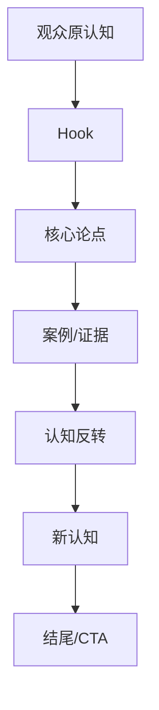

# Phase 3.1 LAN Review Bundle V4

**提交时间**: 2026-09-08 06:52 GMT+8
**状态**: READY_FOR_LAN_REVIEW
**Pipeline Version**: V3
**ASR Version**: Base + Spoken Unit Aggregation

---

## SAMPLE 1

### 基本信息
- **content_id**: 7302348364815928612
- **标题**: 从1到100万 普通人第一桶金
- **创作者**: 男***門
- **viral_type**: ABSOLUTE_VIRAL
- **时长**: 205.37秒
- **点赞**: 1,112,455
- **评论**: 61,476
- **收藏**: 279,069
- **分享**: 493,633

---

### Metrics V3 (Program Generated)

| 指标 | 值 |
|------|-----|
| 时长 | 205.37秒 |
| ASR Segments | 111 |
| Spoken Units | 1 |
| 平均意群长度 | 863.0字 |
| 中位意群长度 | 863字 |
| 短意群比例 | 0.0% |
| 中等意群比例 | 0.0% |
| 长意群比例 | 100.0% |
| 总字符 | 863 |
| 字符/秒 | 4.2 |
| 问句数 | 0 |
| 反问数 | 0 |
| 问句率 | 0.0% |
| 第一人称 | 1 |
| 第二人称 | 25 |
| 转折词 | 3 |
| 对比词 | 9 |
| 案例标记 | 2 |
| 数字表达 | 8 |
| 金钱表达 | 0 |
| 填充词 | 5 |
| Transcript SHA256 | 63fdb916475cd05d |

---

### Complete Cognitive Timeline

# Cognitive Timeline Analysis

**Video Duration**: 205.4s
**Total Segments**: 111
**Total Spoken Units**: 1

---

| Timeline ID | Time Range | Source Units | Function | Source Text |
|-------------|------------|--------------|----------|-------------|
| T001 | 0.00–205.24 | U0001 | CONTRAST/TRANSITION/EXAMPLE/HOOK | 從一到一百萬普通人該怎麼賺到自己的第一桶這個視頻你吸收的約多大概率在三十歲以內就能賺到一定要記得從零到一的考驗是你的個人... |

---

## Unit Detail

| Unit ID | Time | Chars | Text |
|---------|------|-------|------|
| U0001 | 0.00–205.24 | 863 | 從一到一百萬普通人該怎麼賺到自己的第一桶這個視頻你吸收的約多大概率在三十歲以內就能賺到一定要記得從零... |

---

### Complete Transcript (first 40 segments)

# Normalized Transcript: 7302348364815928612

**Note**: Awaiting manual quality check. Raw output below.

---

[S0001] [00:00.00 - 00:02.04] 從一到一百萬
[S0002] [00:02.04 - 00:05.32] 普通人該怎麼賺到自己的第一桶
[S0003] [00:05.32 - 00:07.28] 這個視頻你吸收的約多
[S0004] [00:07.28 - 00:10.52] 大概率在三十歲以內就能賺到
[S0005] [00:10.52 - 00:11.52] 一定要記得
[S0006] [00:11.52 - 00:14.92] 從零到一的考驗是你的個人能力
[S0007] [00:14.92 - 00:17.68] 從一到一百則考驗的是團隊能力
[S0008] [00:17.68 - 00:18.52] 總之能力
[S0009] [00:18.52 - 00:19.80] 所以從零到一
[S0010] [00:19.80 - 00:22.32] 你要不停的學習做跌帶
[S0011] [00:22.32 - 00:24.00] 打開自己的思想
[S0012] [00:24.00 - 00:26.28] 首先如果你不是富二代
[S0013] [00:26.28 - 00:29.20] 你的第一筆錢只有三個來源的方向
[S0014] [00:29.20 - 00:32.00] 打工 借錢 帶塊
[S0015] [00:32.00 - 00:33.68] 如果你不靠後兩者
[S0016] [00:33.68 - 00:35.48] 那你第一筆錢一定是靠
[S0017] [00:35.48 - 00:37.24] 積累擋下來的
[S0018] [00:37.24 - 00:39.72] 比如你還是一個上班級
[S0019] [00:39.72 - 00:42.92] 就一定要學會客具自己的臺項
[S0020] [00:42.92 - 00:44.36] 把數字降下來
[S0021] [00:44.36 - 00:46.12] 你省出來的這一部分錢
[S0022] [00:46.12 - 00:47.72] 會積少省多
[S0023] [00:47.72 - 00:49.56] 千萬不要小開數字
[S0024] [00:49.56 - 00:50.56] 你的工資
[S0025] [00:50.56 - 00:54.16] 信用卡 花貝 戒備 儘量 謹慎一點
[S0026] [00:54.16 - 00:56.04] 因為沒有任何人會給你
[S0027] [00:56.24 - 00:59.20] 偽裝出來的大方而買的
[S0028] [00:59.20 - 00:59.88] 第二
[S0029] [00:59.88 - 01:01.44] 當你手裡說錢
[S0030] [01:01.44 - 01:03.16] 積累到一定的額路口子
[S0031] [01:03.16 - 01:05.20] 比如說你身上有十萬
[S0032] [01:05.20 - 01:06.96] 三十萬 五十萬
[S0033] [01:06.96 - 01:08.48] 不要去買車買吧
[S0034] [01:08.48 - 01:09.80] 首先
[S0035] [01:09.80 - 01:11.60] 如果不是必要帶路
[S0036] [01:11.60 - 01:13.28] 這次錢根本不足以
[S0037] [01:13.28 - 01:15.84] 能讓你買量很好的車
[S0038] [01:15.84 - 01:18.20] 而買方在大城市有可能
[S0039] [01:18.20 - 01:20.64] 點一間廁所都買不到
... (118 total segments)

---

### Logic Map

*Logic Map待基于Spoken Units和Cognitive Timeline填充*

---

## SAMPLE 2

### 基本信息
- **content_id**: 7647797848847439706
- **标题**: 普通人如何靠卖货翻身
- **创作者**: 辉***累
- **viral_type**: RELATIVE_BREAKOUT
- **时长**: 170.2秒
- **点赞**: 144,012
- **评论**: 16,989
- **收藏**: 56,538
- **分享**: 26,515

---

### Metrics V3 (Program Generated)

| 指标 | 值 |
|------|-----|
| 时长 | 170.2秒 |
| ASR Segments | 99 |
| Spoken Units | 1 |
| 平均意群长度 | 864.0字 |
| 中位意群长度 | 864字 |
| 短意群比例 | 0.0% |
| 中等意群比例 | 0.0% |
| 长意群比例 | 100.0% |
| 总字符 | 864 |
| 字符/秒 | 5.08 |
| 问句数 | 1 |
| 反问数 | 1 |
| 问句率 | 100.0% |
| 第一人称 | 7 |
| 第二人称 | 31 |
| 转折词 | 5 |
| 对比词 | 2 |
| 案例标记 | 0 |
| 数字表达 | 11 |
| 金钱表达 | 3 |
| 填充词 | 21 |
| Transcript SHA256 | 6c0e2d097d5e26d4 |

---

### Complete Cognitive Timeline

# Cognitive Timeline Analysis

**Video Duration**: 170.2s
**Total Segments**: 99
**Total Spoken Units**: 1

---

| Timeline ID | Time Range | Source Units | Function | Source Text |
|-------------|------------|--------------|----------|-------------|
| T001 | 0.00–170.20 | U0001 | TRANSITION/HOOK | 尽量不要去打工实在不行你就一边打工一边找一个靠谱的产品去卖只要是开始卖东西你就会快速的进入到真实的社会的模式这句话是我花... |

---

## Unit Detail

| Unit ID | Time | Chars | Text |
|---------|------|-------|------|
| U0001 | 0.00–170.20 | 864 | 尽量不要去打工实在不行你就一边打工一边找一个靠谱的产品去卖只要是开始卖东西你就会快速的进入到真实的社... |

---

### Complete Transcript (first 40 segments)

# Normalized Transcript: 7647797848847439706

**Note**: Awaiting manual quality check. Raw output below.

---

[S0001] [00:00.00 - 00:01.20] 尽量不要去打工
[S0002] [00:01.20 - 00:01.92] 实在不行
[S0003] [00:01.92 - 00:02.92] 你就一边打工
[S0004] [00:02.92 - 00:05.72] 一边找一个靠谱的产品去卖
[S0005] [00:05.72 - 00:07.32] 只要是开始卖东西
[S0006] [00:07.32 - 00:10.36] 你就会快速的进入到真实的社会的模式
[S0007] [00:10.36 - 00:12.44] 这句话是我花了十年的时间
[S0008] [00:12.44 - 00:14.40] 赚了无数次的南墙才误出来的
[S0009] [00:14.40 - 00:16.20] 那为什么不建议打工呢
[S0010] [00:16.20 - 00:18.44] 打工的本质就是你把你的时间体力
[S0011] [00:18.44 - 00:20.64] 情绪打包卖给了老板
[S0012] [00:20.64 - 00:21.76] 那么在这套体系里面
[S0013] [00:21.76 - 00:24.20] 你就是那个被保护起来的罗斯丁
[S0014] [00:24.20 - 00:25.88] 不用知道产品怎么卖
[S0015] [00:25.88 - 00:26.68] 不用懂客户
[S0016] [00:26.68 - 00:27.88] 为什么会离去
[S0017] [00:27.88 - 00:30.16] 你只要PPT写得好就可以了
[S0018] [00:30.16 - 00:31.92] 打工给你最大的毒药
[S0019] [00:31.92 - 00:33.64] 它就掉到确定性
[S0020] [00:33.64 - 00:35.12] 每个月到了日子
[S0021] [00:35.12 - 00:37.08] 那个工资雷打不动道仗
[S0022] [00:37.08 - 00:38.68] 这种虚假的安全感
[S0023] [00:38.68 - 00:39.92] 会一点点废掉
[S0024] [00:39.92 - 00:42.48] 你这个感知真实时间的能力
[S0025] [00:42.48 - 00:44.04] 等到了35岁
[S0026] [00:44.04 - 00:44.84] 你被优化
[S0027] [00:44.84 - 00:46.12] 被扔回了社会
[S0028] [00:46.12 - 00:47.60] 你才发现除了内号
[S0029] [00:47.60 - 00:49.36] 会写这个周报
[S0030] [00:49.36 - 00:52.40] 你根本就看不懂这个社会是怎么运转的
[S0031] [00:52.40 - 00:54.60] 那么什么才是真实的社会模式呢
[S0032] [00:54.60 - 00:56.56] 就是交易
[S0033] [00:56.56 - 00:58.32] 市场不认你的头显
[S0034] [00:58.32 - 01:01.08] 只认你能不能够把产品卖出去
[S0035] [01:01.08 - 01:01.80] 很多人跟我说
[S0036] [01:01.80 - 01:02.80] 我不敢辞职
[S0037] [01:02.80 - 01:05.00] 让我没有本金用怕失败
[S0038] [01:05.00 - 01:06.52] 所以我才跟你们讲嘛
[S0039] [01:06.52 - 01:07.32] 实在不行
... (106 total segments)

---

### Logic Map

*Logic Map待基于Spoken Units和Cognitive Timeline填充*

---

## SAMPLE 3

### 基本信息
- **content_id**: 7546212425998454074
- **标题**: 除了打工，用心给大家整理了16条路
- **创作者**: 小***究
- **viral_type**: NORMAL_REFERENCE
- **时长**: 245.83秒
- **点赞**: 410,006
- **评论**: 106,874
- **收藏**: 263,470
- **分享**: 83,064

---

### Metrics V3 (Program Generated)

| 指标 | 值 |
|------|-----|
| 时长 | 245.83秒 |
| ASR Segments | 102 |
| Spoken Units | 1 |
| 平均意群长度 | 1622.0字 |
| 中位意群长度 | 1622字 |
| 短意群比例 | 0.0% |
| 中等意群比例 | 0.0% |
| 长意群比例 | 100.0% |
| 总字符 | 1622 |
| 字符/秒 | 6.6 |
| 问句数 | 1 |
| 反问数 | 0 |
| 问句率 | 100.0% |
| 第一人称 | 19 |
| 第二人称 | 18 |
| 转折词 | 6 |
| 对比词 | 9 |
| 案例标记 | 7 |
| 数字表达 | 13 |
| 金钱表达 | 0 |
| 填充词 | 8 |
| Transcript SHA256 | 5cd8c03bd03ee125 |

---

### Complete Cognitive Timeline

# Cognitive Timeline Analysis

**Video Duration**: 245.8s
**Total Segments**: 102
**Total Spoken Units**: 1

---

| Timeline ID | Time Range | Source Units | Function | Source Text |
|-------------|------------|--------------|----------|-------------|
| T001 | 0.00–245.80 | U0001 | CONTRAST/EXAMPLE/HOOK | 除了打工 至少還有16種賺錢的方法今天我給大家整理了16個全廣所有的搞錢思路一次性開隔局 大家可以對照適合自己路線提高個... |

---

## Unit Detail

| Unit ID | Time | Chars | Text |
|---------|------|-------|------|
| U0001 | 0.00–245.80 | 1622 | 除了打工 至少還有16種賺錢的方法今天我給大家整理了16個全廣所有的搞錢思路一次性開隔局 大家可以對... |

---

### Complete Transcript (first 40 segments)

# Normalized Transcript: 7546212425998454074

**Note**: Awaiting manual quality check. Raw output below.

---

[S0001] [00:00.00 - 00:02.30] 除了打工 至少還有16種賺錢的方法
[S0002] [00:02.30 - 00:05.30] 今天我給大家整理了16個全廣所有的搞錢思路
[S0003] [00:05.30 - 00:09.30] 一次性開隔局 大家可以對照適合自己路線提高個人生產力
[S0004] [00:09.30 - 00:12.30] 第一種 轉擦架的錢 說白了 就是當中間商
[S0005] [00:12.30 - 00:15.90] 什麼東西 這一邊便宜那邊會 就把他從甜蜜的地方 賣到貴的地方
[S0006] [00:15.90 - 00:19.50] 別覺得這件事情老土 這個是最古早 也最有效的專程邏輯
[S0007] [00:19.50 - 00:23.70] 第二種是賺流量的錢 現在誰都不快手機 這個就是我們的機會
[S0008] [00:23.70 - 00:27.00] 不論是哪個平台 你可以去發文章 發視頻做直播
[S0009] [00:27.00 - 00:30.60] 只要有人看的地方你就有了流量 有的流量 你就可以買自己的產品
[S0010] [00:30.60 - 00:32.60] 沒有貨員 就可以買別人的拿分成
[S0011] [00:32.60 - 00:36.40] 甚至你還可以接廣告 幫商家戴貨 流量 本質上就是錢
[S0012] [00:36.40 - 00:39.80] 第三種 賺稀缺的錢 把它盤點一下手裡面有沒有 你有
[S0013] [00:39.80 - 00:42.40] 但是別人沒有的東西 可能是一種獨特的技術
[S0014] [00:42.40 - 00:44.60] 也有可能是一種別人接觸不到的人賣資源
[S0015] [00:44.60 - 00:47.80] 或者是一個別人買到的渠道 人物我有就是王牌
[S0016] [00:47.80 - 00:50.40] 一旦掌握了稀缺資源 並價權就在我們的手裡面
[S0017] [00:50.40 - 00:54.40] 第四種是賺出城的錢 一個人可能幹到類似 也發表大財
[S0018] [00:54.40 - 00:58.00] 聰明的人是怎麼樣做的 他們是去找那種比自己更能幹的人
[S0019] [00:58.00 - 01:01.20] 來為自己工作 然後從別人的生命裡面去拿底層
[S0020] [01:01.20 - 01:04.60] 他的團隊越大 系統越完善 他賺的錢就會越多實現負力
[S0021] [01:04.60 - 01:07.60] 第五種是賺地獄 差的錢 咱們國家那了大
[S0022] [01:07.60 - 01:10.40] 很多地方的特產 在別的地方就是稀行貨
[S0023] [01:10.40 - 01:13.20] 把一個東西 從產能貨生的地方 運到稀缺的地方
[S0024] [01:13.20 - 01:15.40] 從大街的地方 賣到沒有人見過他的地方
[S0025] [01:15.40 - 01:17.80] 是中間的利潤 是超貨我們的想像的
[S0026] [01:17.80 - 01:22.20] 第六種 賺任之差的錢 記住有一句話是叫內行 賺外行的錢
[S0027] [01:22.30 - 01:24.50] 大家在自己的行業裡面擔酒了 會麻木
[S0028] [01:24.50 - 01:27.00] 但是你總規是比圈外人懂得多吧
[S0029] [01:27.00 - 01:30.60] 這個就是咱們的資本 你可以做培訓 做諮詢 做付費社群
[S0030] [01:30.60 - 01:34.40] 把你的專業支持變成錢 第七種是賺品牌的錢
[S0031] [01:34.40 - 01:37.50] 為什麼同樣已經衣服貼一個品牌的標 它的價格就可以發好幾倍
[S0032] [01:37.50 - 01:39.80] 這個就是屬於我們常說的品牌藝家
[S0033] [01:39.80 - 01:41.80] 一旦咱們品牌建立起來 有了新增度
[S0034] [01:41.80 - 01:45.50] 你的產品就有了金字招牌 利用空間自然就大了很多
[S0035] [01:45.50 - 01:47.50] 第八種是賺規模的錢
[S0036] [01:47.50 - 01:50.10] 當咱們的銷量足夠大就會產生規模效應
[S0037] [01:50.20 - 01:52.40] 每一件產品的利潤會降到極低
[S0038] [01:52.40 - 01:55.10] 就算擔見的利潤不像指體一樣 就像那間工廠一樣
[S0039] [01:55.10 - 01:57.00] 但是因為它的數量過於巨大
... (109 total segments)

---

### Logic Map

*Logic Map待基于Spoken Units和Cognitive Timeline填充*

---

# CROSS SAMPLE COMPARISON

| 指标 | Sample 1 | Sample 2 | Sample 3 |
|------|----------|----------|----------|
| ABSOLUTE_VIRAL | 从1到100万 普通人第一桶金... | 205.37s | 1 units | 863 chars | 8 nums | 0 questions |
| RELATIVE_BREAKOUT | 普通人如何靠卖货翻身... | 170.2s | 1 units | 864 chars | 11 nums | 1 questions |
| NORMAL_REFERENCE | 除了打工，用心给大家整理了16... | 245.83s | 1 units | 1622 chars | 13 nums | 1 questions |

---

## 共同点

1. 都是认知类口播内容
2. 都使用真实ASR转录
3. 都经过Spoken Unit聚合
4. Metrics V3程序化计算

---

## 差异观察

*需基于真实数据填充*

---

*V4版本: 所有数据基于Spoken Unit聚合、程序化Metrics计算*
*Pipeline Version: V3*