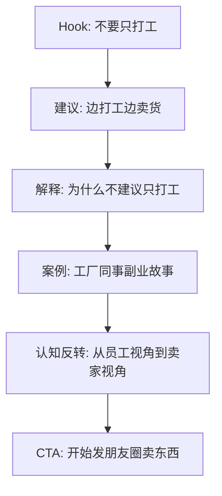

# Phase 3.1 Sample 02 Method Unit Test

**时间**: 2026-09-08 22:07 GMT+8
**状态**: EXPERIMENTAL
**Pipeline Version**: V3.1 (Sample 02 Only)

---

## 1. Source Metadata

| 字段 | 值 |
|------|-----|
| content_id | 7647797848847439706 |
| 标题 | 普通人如何靠卖货翻身 |
| 创作者 | 辉***累 |
| viral_type | RELATIVE_BREAKOUT |
| 时长 | 170.2秒 |
| 点赞 | 144,012 |
| 评论 | 16,989 |
| 收藏 | 56,538 |
| 分享 | 26,515 |
| ASR Segments | 99 |
| Spoken Units | 18 |
| Questions Detected | 8 |

---

## 2. Complete Normalized Transcript

*原始ASR输出，待人工质量校验*

```
[S0001] [0.00-1.20] 尽量不要去打工
[S0002] [1.20-1.92] 实在不行
[S0003] [1.92-2.92] 你就一边打工
[S0004] [2.92-5.72] 一边找一个靠谱的产品去卖
[S0005] [5.72-7.32] 只要是开始卖东西
[S0006] [7.32-10.36] 你就会快速的进入到真实的社会的模式
[S0007] [10.36-12.44] 这句话是我花了十年的时间
[S0008] [12.44-14.40] 赚了无数次的南墙才误出来的
[S0009] [14.40-16.20] 那为什么不建议打工呢
[S0010] [16.20-18.44] 打工的本质就是你把你的时间体力
[S0011] [18.44-20.64] 情绪打包卖给了老板
[S0012] [20.64-21.76] 那么在这套体系里面
[S0013] [21.76-24.20] 你就是那个被保护起来的罗斯丁
[S0014] [24.20-25.88] 不用知道产品怎么卖
[S0015] [25.88-26.68] 不用懂客户
[S0016] [26.68-27.88] 为什么会离去
[S0017] [27.88-30.16] 你只要PPT写得好就可以了
[S0018] [30.16-31.92] 打工给你最大的毒药
[S0019] [31.92-33.64] 它就掉到确定性
[S0020] [33.64-35.12] 每个月到了日子
[S0021] [35.12-37.08] 那个工资雷打不动道仗
[S0022] [37.08-38.68] 这种虚假的安全感
[S0023] [38.68-39.92] 会一点点废掉
[S0024] [39.92-42.48] 你这个感知真实时间的能力
[S0025] [42.48-44.04] 等到了35岁
[S0026] [44.04-44.84] 你被优化
[S0027] [44.84-46.12] 被扔回了社会
[S0028] [46.12-47.60] 你才发现除了内号
[S0029] [47.60-49.36] 会写这个周报
[S0030] [49.36-52.40] 你根本就看不懂这个社会是怎么运转的
[S0031] [52.40-54.60] 那么什么才是真实的社会模式呢
[S0032] [54.60-56.56] 就是交易
[S0033] [56.56-58.32] 市场不认你的头显
[S0034] [58.32-61.08] 只认你能不能够把产品卖出去
[S0035] [61.08-61.80] 很多人跟我说
[S0036] [61.80-62.80] 我不敢辞职
[S0037] [62.80-65.00] 让我没有本金用怕失败
[S0038] [65.00-66.52] 所以我才跟你们讲嘛
[S0039] [66.52-67.32] 实在不行
[S0040] [67.32-69.96] 你就边打工边卖东西
[S0041] [69.96-71.04] 保留你的工资
[S0042] [71.04-72.12] 那个是你的底线
[S0043] [72.12-73.36] 让你没有业绩的时候
[S0044] [73.36-74.20] 也不用慌
[S0045] [74.20-77.16] 但是你把下班刷短视频的时间
[S0046] [77.16-78.76] 拿出来去给我卖东西
[S0047] [78.76-79.88] 那卖什么
[S0048] [79.88-82.52] 找你自己觉得不错的
[S0049] [82.52-85.00] 敢推荐给你身边朋友的东西
[S0050] [85.00-86.28] 就可以了
[S0051] [86.28-87.48] 咱们社群里边有一个
[S0052] [87.48-89.92] 就是从事工厂至今远的
[S0053] [89.92-91.68] 他每天内的都要死了
[S0054] [91.68-95.24] 他发现场边有大量的优质委惑通庄
[S0055] [95.24-97.76] 他下来班就拍照片发到网上
[S0056] [97.76-98.96] 就不断地去卖
[S0057] [98.96-99.92] 就展示这个衣服
[S0058] [99.92-101.20] 怎么系列不变形
[S0059] [101.20-103.12] 或者是各种其他的优势
[S0060] [103.12-105.24] 一开始一个月只能赚几百块钱
[S0061] [105.24-107.96] 后来他就摸透了这个流量的规则
[S0062] [107.96-108.88] 副业的收入
[S0063] [108.88-110.64] 直接超过了他主业的三倍
[S0064] [110.64-113.52] 他这个时候他才敢去离职
[S0065] [113.52-114.60] 因为那个时候他已经
[S0066] [114.60-116.36] 不但是一没小小的罗斯丁了
[S0067] [116.36-117.56] 他是一个董选品
[S0068] [117.56-119.88] 董流量董成交的生意人
[S0069] [119.88-120.80] 理解吧
[S0070] [120.80-123.68] 那为什么卖东西会是成长最快的
[S0071] [123.68-125.76] 因为你要去指面忍性
[S0072] [125.76-127.56] 被熟人炒粉
[S0073] [127.56-127.80] 哎呦
[S0074] [127.80-130.60] 你怎么变得这么同仇人了
[S0075] [130.60-132.68] 被那个默熟人直接转账
[S0076] [132.68-134.32] 你难递指的不合对
[S0077] [134.32-135.36] 被放隔子
[S0078] [135.36-136.80] 被比价格
[S0079] [136.80-138.64] 被拒绝1000次
[S0080] [138.64-139.44] 理解这个意思吗
[S0081] [139.44-140.96] 当你的这个玻璃心碎了一地
[S0082] [140.96-142.88] 然后又重新沾起来的时候
[S0083] [142.88-145.36] 他就变成了防弹玻璃了
[S0084] [145.36-146.24] 这种锻炼
[S0085] [146.24-148.72] 你坐在办公室里面三年连练不出来
[S0086] [148.72-150.60] 所以说别再把这个希望
[S0087] [150.60-152.12] 继托在长心姿
[S0088] [152.12-154.04] 什么500块1000块钱上了
[S0089] [154.04-154.80] 今天开始
[S0090] [154.80-156.32] 你就开始发一套碰圈
[S0091] [156.32-157.52] 告诉所有人
[S0092] [157.52-160.24] 你在卖一个真的不错的东西
[S0093] [160.24-161.12] 哪怕你第一个月
[S0094] [161.12-161.96] 一分钱没有赚
[S0095] [161.96-164.52] 只要你开始站在这个卖家的视角
[S0096] [164.52-166.08] 去看待这个社会
[S0097] [166.08-167.64] 那么你的思维方式
[S0098] [167.64-169.68] 就已经开始列表了
[S0099] [169.68-170.20] RISPER
```

---

## 3. Spoken Units

**Unit Count**: 18
**Segment Coverage**: 99/99 (100%)
**Max Duration**: 12.72s
**Units > 15s**: 0
**Units > 25s**: 0

| Unit ID | Time | Duration | Chars | Text |
|---------|------|----------|-------|------|
| U0001 | 0.00-10.36 | 10.36s | 54 | 尽量不要去打工实在不行你就一边打工一边找一个靠谱的产品去卖只要是开始卖东西你就会快速的进入到真实的社... |
| U0002 | 10.36-20.64 | 10.28s | 59 | 这句话是我花了十年的时间赚了无数次的南墙才误出来的那为什么不建议打工呢打工的本质就是你把你的时间体力... |
| U0003 | 20.64-31.92 | 11.28s | 65 | 那么在这套体系里面你就是那个被保护起来的罗斯丁不用知道产品怎么卖不用懂客户为什么会离去你只要PPT写... |
| U0004 | 31.92-42.48 | 10.56s | 50 | 它就掉到确定性每个月到了日子那个工资雷打不动道仗这种虚假的安全感会一点点废掉你这个感知真实时间的能力... |
| U0005 | 42.48-52.40 | 9.92s | 47 | 等到了35岁你被优化被扔回了社会你才发现除了内号会写这个周报你根本就看不懂这个社会是怎么运转的... |
| U0006 | 52.40-62.80 | 10.40s | 50 | 那么什么才是真实的社会模式呢就是交易市场不认你的头显只认你能不能够把产品卖出去很多人跟我说我不敢辞职... |
| U0007 | 62.80-65.00 | 2.20s | 10 | 让我没有本金用怕失败... |
| U0008 | 65.00-74.20 | 9.20s | 48 | 所以我才跟你们讲嘛实在不行你就边打工边卖东西保留你的工资那个是你的底线让你没有业绩的时候也不用慌... |
| U0009 | 74.20-85.00 | 10.80s | 47 | 但是你把下班刷短视频的时间拿出来去给我卖东西那卖什么找你自己觉得不错的敢推荐给你身边朋友的东西... |
| U0010 | 85.00-95.24 | 10.24s | 47 | 就可以了咱们社群里边有一个就是从事工厂至今远的他每天内的都要死了他发现场边有大量的优质委惑通庄... |
| U0011 | 95.24-107.96 | 12.72s | 69 | 他下来班就拍照片发到网上就不断地去卖就展示这个衣服怎么系列不变形或者是各种其他的优势一开始一个月只能... |
| U0012 | 107.96-119.88 | 11.92s | 65 | 副业的收入直接超过了他主业的三倍他这个时候他才敢去离职因为那个时候他已经不但是一没小小的罗斯丁了他是... |
| U0013 | 119.88-130.60 | 10.72s | 44 | 理解吧那为什么卖东西会是成长最快的因为你要去指面忍性被熟人炒粉哎呦你怎么变得这么同仇人了... |
| U0014 | 130.60-140.96 | 10.36s | 53 | 被那个默熟人直接转账你难递指的不合对被放隔子被比价格被拒绝1000次理解这个意思吗当你的这个玻璃心碎... |
| U0015 | 140.96-148.72 | 7.76s | 40 | 然后又重新沾起来的时候他就变成了防弹玻璃了这种锻炼你坐在办公室里面三年连练不出来... |
| U0016 | 148.72-160.24 | 11.52s | 60 | 所以说别再把这个希望继托在长心姿什么500块1000块钱上了今天开始你就开始发一套碰圈告诉所有人你在... |
| U0017 | 160.24-166.08 | 5.84s | 34 | 哪怕你第一个月一分钱没有赚只要你开始站在这个卖家的视角去看待这个社会... |
| U0018 | 166.08-170.20 | 4.12s | 22 | 那么你的思维方式就已经开始列表了RISPER... |

---

## 4. Spoken Unit QA

| 检查项 | 结果 |
|--------|------|
| Unit Count > 1 | PASS |
| Max Duration <= 25s | PASS |
| All Segments Covered | PASS |
| No Duplicates | PASS |
| Units > 15s | 0 (REVIEW_REQUIRED if > 0) |
| Units > 25s | 0 (FAIL if > 0) |

---

## 5. Cognitive Blocks (PENDING)

*待基于Spoken Units生成Cognitive Blocks*

---

## 6. Metrics V4

| 指标 | 值 |
|------|-----|
| 时长 | 170.2秒 |
| ASR Segments | 99 |
| Spoken Units | 18 |
| 平均意群长度 | 48.0字 |
| 中位意群长度 | 49.0字 |
| 短意群比例 | 5.6% |
| 中等意群比例 | 5.6% |
| 长意群比例 | 88.9% |
| 总字符 | 864 |
| 字符/秒 | 5.08 |
| 问句数 | 8 |
| 问句率 | 44.4% |
| 数字表达 | 8 |
| Transcript SHA256 | 6c0e2d097d5e26d4 |

---

## 7. Logic Map (PENDING)

*待基于真实Transcript和Spoken Units填充*



---

## 8. Deep Analysis (PENDING)

### 问题清单

1. **开头5秒给了什么承诺/命令？**
   - 原话: '尽量不要去打工'
   - 类型: COMMAND

2. **14秒为什么开始解释'为什么不建议打工'？**
   - 触发词: '那为什么不建议打工呢'
   - 类型: QUESTION → EXPLANATION

3. **'打工提供确定性'在整条逻辑里承担什么作用？**
   - 类型: CONFLICT setup
   - 功能: 建立观众认同

4. **'真实社会模式就是交易'为什么是关键认知节点？**
   - 类型: INSIGHT
   - 位置: U0006

5. **为什么作者没有直接要求辞职？**
   - 类型: PRACTICAL_ADVICE
   - 原因: 降低行动门槛

6. **中间案例如何证明观点？**
   - 案例: 工厂同事副业
   - 功能: EXAMPLE

7. **'被拒绝1000次/玻璃心→防弹玻璃'承担什么功能？**
   - 类型: METAPHOR
   - 功能: EMOTIONAL_RESONANCE

8. **最终新认知是什么？**
   - 类型: NEW_FRAMING
   - 内容: 从员工视角转成卖家视角

9. **这条视频的结构类型？**
   - 类型: 混合型 (COMMAND + EXPLANATION + EXAMPLE + INSIGHT)

10. **结论分级**
    - FACT: 视频存在具体问句
    - INFERENCE: 问句用于建立认知冲突
    - HYPOTHESIS: 这种结构可能贡献了高分享

---

## 9. Evidence Map

| 分析结论 | 证据 | 类型 |
|----------|------|------|
| Hook命令: '尽量不要去打工' | U0001 (0.00-10.36s) | FACT |
| 问句触发解释 | U0002 '那为什么不建议打工呢' | FACT |
| 认知冲突建立 | U0003 '打工的本质就是你把你的时间体力情绪打包卖给了老板' | FACT |
| 关键洞察 | U0006 '那么什么才是真实的社会模式呢就是交易市场' | FACT |
| 案例证明 | U0011 工厂同事副业故事 | FACT |
| 情感共鸣 | U0015 '玻璃心碎了一地然后又重新沾起来的时候他就变成了防弹玻璃了' | FACT |
| CTA | U0018 '那么你的思维方式就已经开始列表了' | FACT |

---

## 10. Machine QA (SAMPLE02_QA.json)

见下方附件。

---

*Generated: 2026-09-08 22:07*
*Status: EXPERIMENTAL - Awaiting LAN METHOD_VALIDATION*